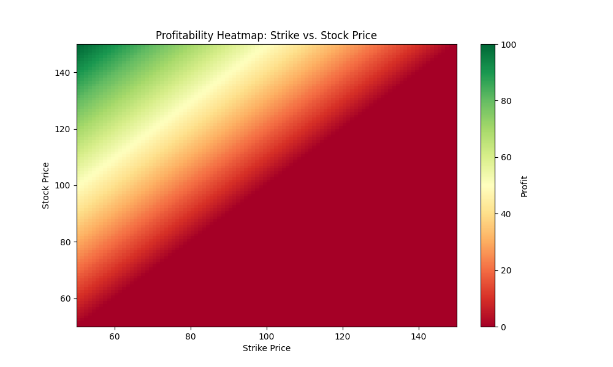

# Project: Quantitative Trading Tool Using Black-Scholes Model

## Overview

This project is a quantitative trading tool built to assist in analyzing and visualizing options pricing using the Black-Scholes model. It also includes advanced features such as PnL tracking, database integration, and a user-friendly GUI.

---

## 1. Core Model Development

- **Input Variables**: Accepts five key inputs for option pricing:
  - Volatility
  - Stock Price
  - Strike Price
  - Time to Expiry
  - Interest Rate
- **Output**: Calculates and displays call and put values based on the Black-Scholes formula.

---

## 2. GUI Implementation (Streamlit or Other)

- **Interactive Dashboard**: A user-friendly dashboard to input values and display calculated results in real time.
- **Option for Saving Inputs**: Enables users to save and retrieve specific configurations for future reference.

---

## 3. Visualization and Analytics

### Profitability Heatmap

This heatmap visualizes the profitability zones based on the strike price and stock price inputs. The green areas indicate higher profitability, while the red areas indicate losses.



### Additional Features

- **Profit and Loss (PnL) Tracking**: Calculates PnL based on user-entered purchase prices, helping visualize potential gains or losses.

---

## 4. Database Integration (MySQL)

- **Input and Output Mapping**: Stores user inputs and outputs in a relational database for easy access and record-keeping.
- **Base Input Table**: Tracks the five main inputs along with unique calculation IDs, allowing historical analysis.

---

## 5. Additional Pricing Models

- **Comparison Tab**: Includes tabs for alternative pricing models (e.g., Binomial, Monte Carlo), allowing users to compare strategies.
- **Model Summary Page**: Aggregates insights from all models, providing a comparative view of option prices.

---

## 6. Client-Server Architecture

- **Backend Server**: Handles calculations and manages data for multiple users, enabling secure data storage and retrieval.
- **Client Interface**: Provides remote access to the tool with a responsive GUI.

---

## Additional Features

- **User Authentication**: Ensures secure access to saved configurations and records.
- **API Integration**: Integrates with APIs like Yahoo Finance for real-time stock price data.

---

## Getting Started

### Prerequisites

- **Python 3.x**: Ensure Python is installed.
- **MySQL**: Set up a database for integration.
- **Libraries**: Install required Python libraries:

```bash
pip install streamlit numpy pandas matplotlib sqlalchemy
```
### Running the Tool

1. Clone the repository:

```bash
git clone <repository-url>
cd quant-trading-tool
```

2. Run the application:

```bash
streamlit run app.py
```

3. Open the app in your browser:

```bash
http://localhost:8501
```

---

## Folder Structure

```plaintext
quant-trading-tool/
├── app.py                 # Main application file
├── database.py            # Database interaction scripts
├── models.py              # Black-Scholes and other pricing models
├── visualizations.py      # Heatmap and other visualization functions
├── requirements.txt       # Python dependencies
└── README.md              # Project documentation
```

---

## Contributing

Contributions are welcome! To contribute:

1. Fork the repository.
2. Create a branch for your changes:

```bash
git checkout -b feature-branch
```

3. Commit and push your changes:

```bash
git push origin feature-branch
```

4. Open a pull request. (AND COMMENT WHAT CHANGES)
```bash
git commit -m "comment"
```

---

## License

This project is licensed under the MIT License. See the `LICENSE` file for more details.
